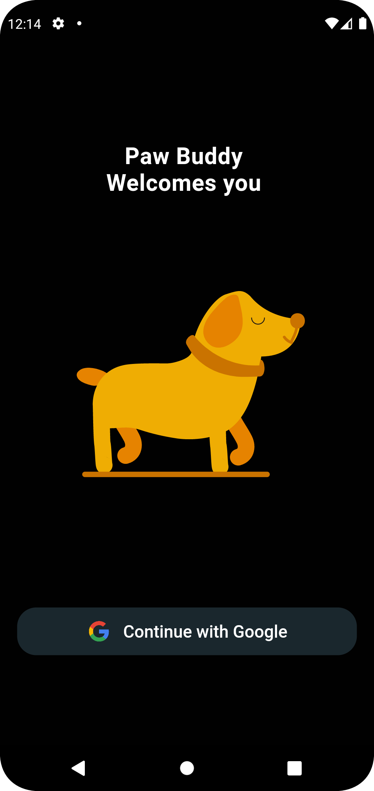
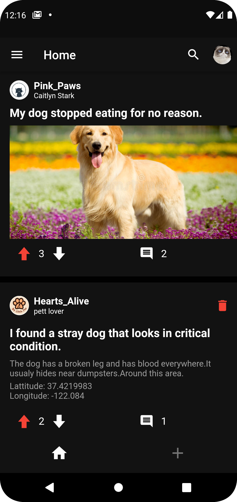
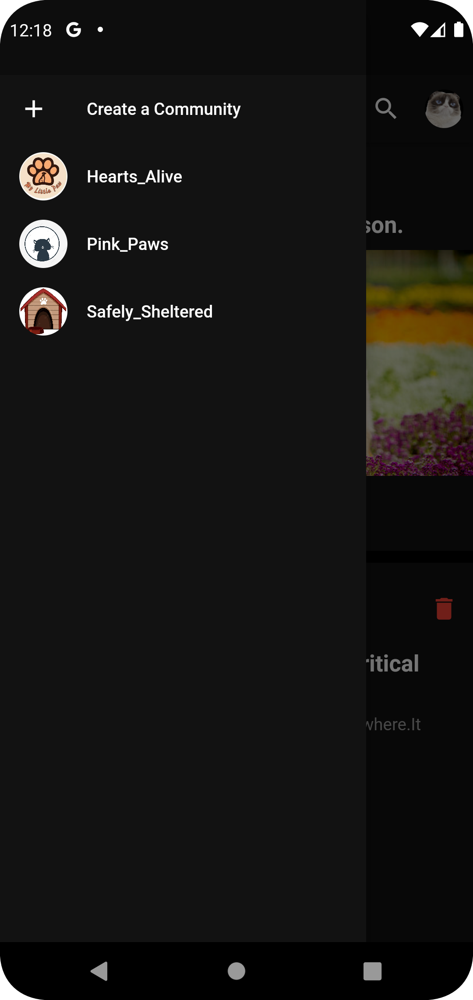
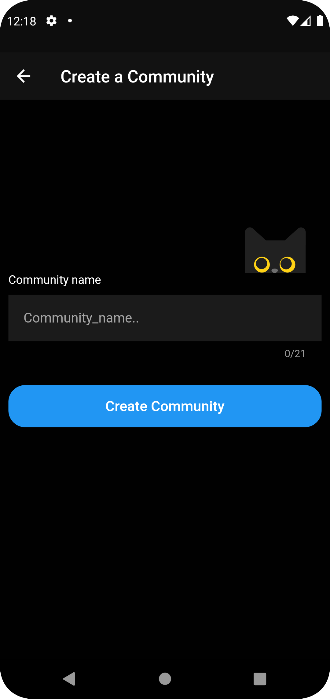
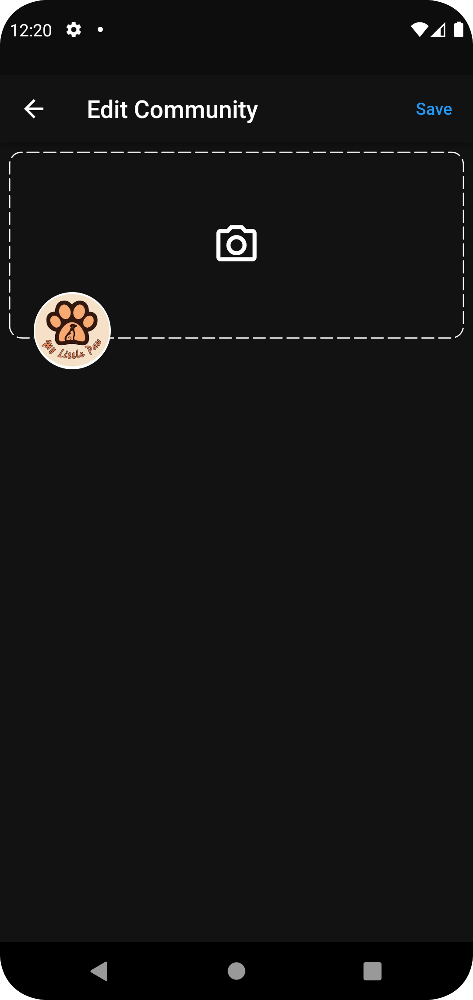
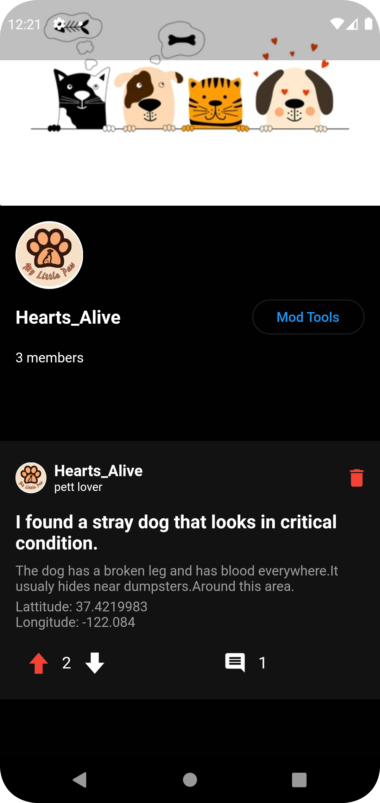
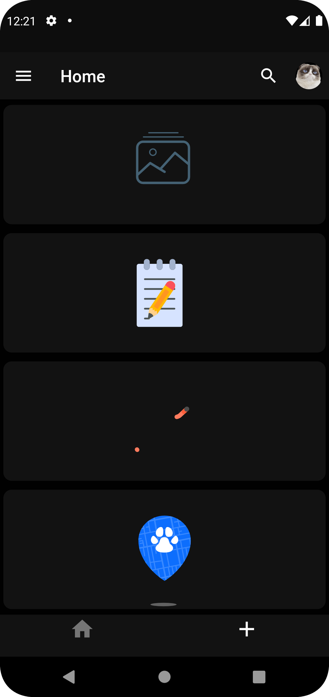
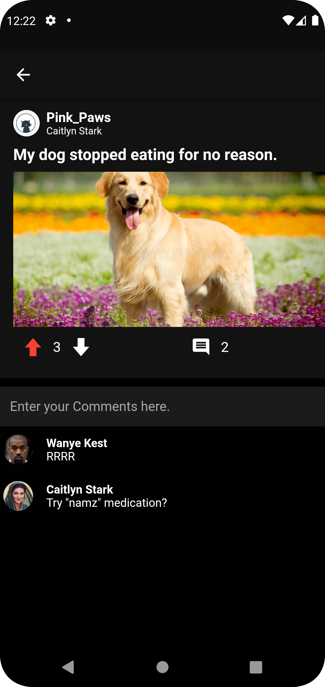

<h1 style="text-decoration: underline">PAW-BUDDY</h1>

Paw-Buddy is a mobile application developed using flutter and firebase for the database.it helps rescuing injured, stray, 
homeless pets and even help normal users with pet issues. 

There is 1 actor who can access  specific functionalities: 

  -Login 
  -Create Community 
  -Posting  
  -commenting 
  -Like/Disliking a post 
  -join/leave community 
  -Along Side the other Features like change name/profile or cover picture ect.. 
  
there are 4 types of Posts each grant the user poinnts: 
  the first three Which you can post in normal communities: 
    1-Image(3 Points) 
    2-Text (2 Points) 
    3-Link (3 Points) 
  and the fourth   
    4-Demand (10 Points), 
    When a person finds a stray or injured animal can use this and a list of Agencies which he is a part of will appear. 
Communities Are Seperated into 2: 
  -Communities 
  -Agencies 
You can chose to join,Leave or create a community on your own and Add moderators which allows them to change cover or delete posts in that particular community. 

Here are some screenshots of the application. 

<table>
  <tr>
    <td></td>
    <td></td>
  </tr>
  <tr>
    <td></td>
    <td></td>
  </tr>
  <tr>
    <td></td>
    <td></td>
  </tr>
  <tr>
    <td></td>
    <td></td>
  </tr>
</table>

